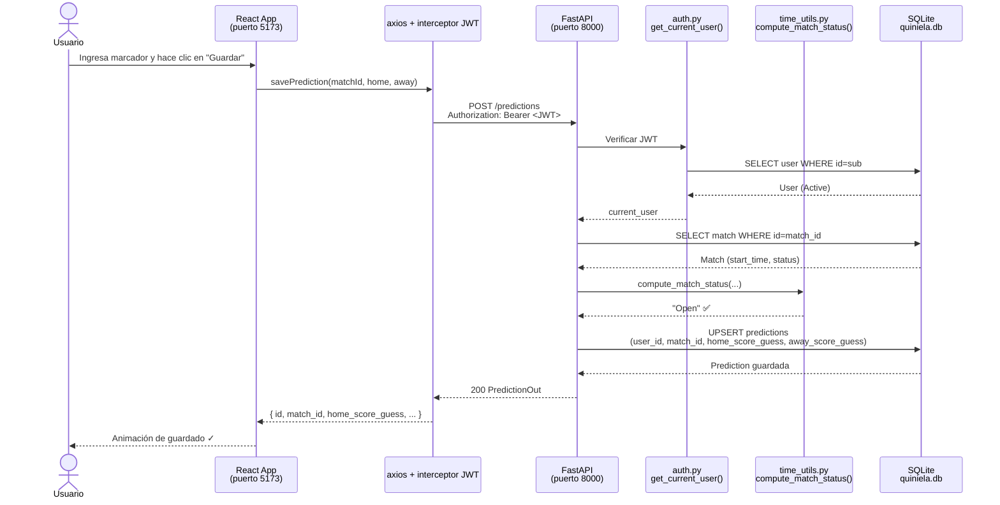
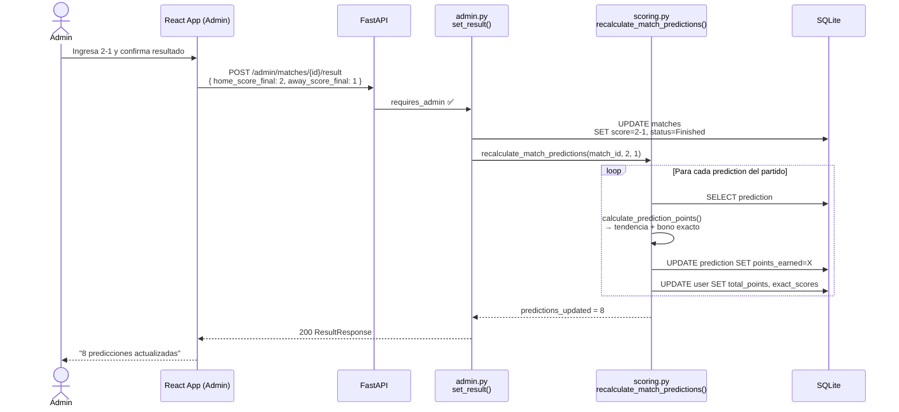
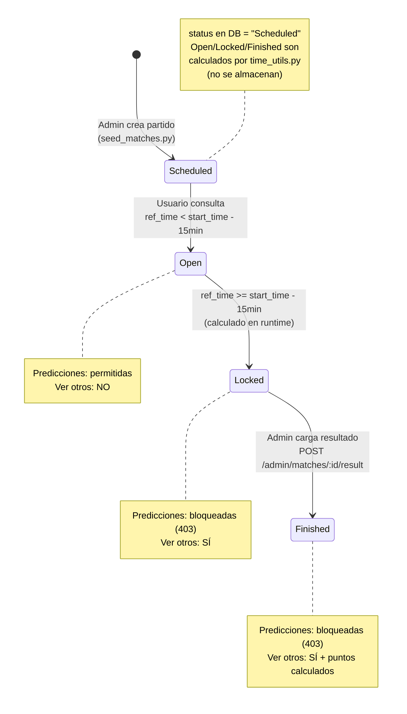
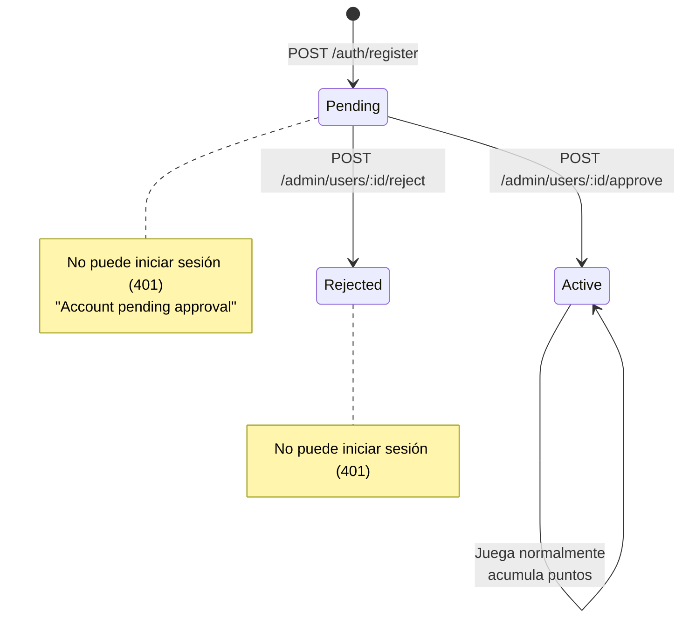
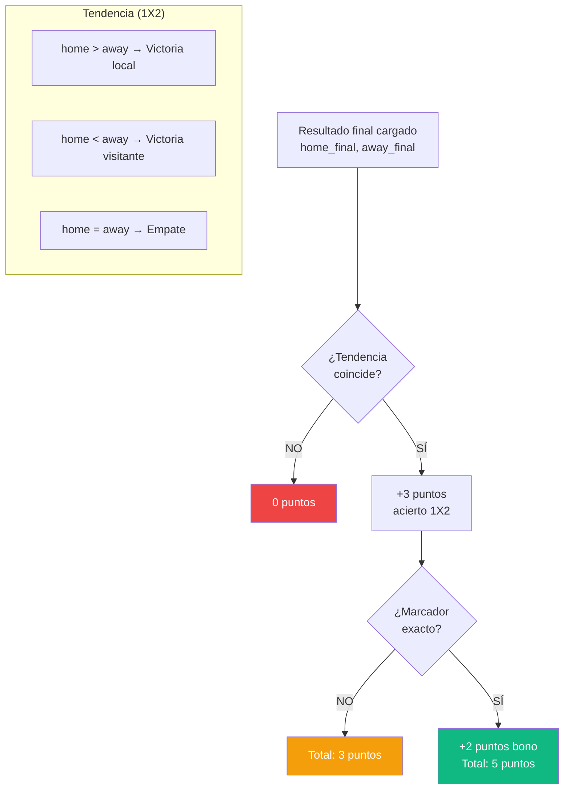

# Diagramas de Arquitectura — Quiniela Mundial 2026

**Generado por:** skill `technical-writer`
**Fecha:** 2026-05-06
**Stack:** FastAPI (Python 3.10+) · SQLite · React 18 / Vite / shadcn/ui

---

## 1. Diagrama de Flujo — Request completo de predicción

Flujo desde el navegador hasta la base de datos para el caso más crítico: guardar una predicción.



---

## 2. Diagrama de Flujo — Carga de resultado y recálculo de puntos

Flujo del Admin al cargar el resultado de un partido (desencadena scoring sincrónico).



---

## 3. Diagrama de Capas — Arquitectura Hexagonal simplificada

```mermaid
graph TB
    subgraph "Capa de Presentación (Frontend)"
        UI[React / Vite / shadcn-ui]
        Store[Zustand authStore]
        APIClient[axios client.ts<br/>+ interceptor JWT]
    end

    subgraph "Capa de Entrada (FastAPI Routers)"
        AuthR[/auth/register<br/>/auth/login]
        UsersR[/users/me<br/>/users/ranking]
        MatchesR[/matches<br/>/matches/:id]
        PredR[/predictions<br/>/predictions/match/:id]
        BonusR[/bonus-questions<br/>/bonus-predictions]
        AdminR[/admin/** requires_admin]
    end

    subgraph "Capa de Aplicación (Lógica de Negocio)"
        AuthMod[auth.py<br/>JWT · bcrypt]
        TimeUtils[time_utils.py<br/>Time Travel · Lock Window]
        Scoring[scoring.py<br/>+3 tendencia · +2 exacto]
    end

    subgraph "Capa de Dominio (Modelos)"
        Models[models.py<br/>User · Match<br/>Prediction · BonusPrediction]
        Schemas[schemas.py<br/>Pydantic v2 request/response]
    end

    subgraph "Capa de Infraestructura"
        DB[(SQLite<br/>quiniela.db)]
        SQLAlchemy[SQLAlchemy ORM<br/>database.py]
        Seed[seed_matches.py<br/>seed_admin.py]
    end

    UI <--> Store
    UI <--> APIClient
    APIClient -->|HTTP/JSON Bearer JWT| AuthR & UsersR & MatchesR & PredR & BonusR & AdminR

    AuthR --> AuthMod
    MatchesR --> TimeUtils
    PredR --> TimeUtils
    AdminR --> Scoring

    AuthMod --> Models
    TimeUtils --> Models
    Scoring --> Models

    Models --> SQLAlchemy
    Schemas -.-> AuthR & UsersR & MatchesR & PredR & BonusR & AdminR
    SQLAlchemy --> DB
    Seed --> DB
```

---

## 4. Diagrama de Estados — Ciclo de vida de un partido



---

## 5. Diagrama de Estados — Ciclo de vida de un usuario



---

## 6. Diagrama de Algoritmo de Puntuación


