# Test Evidence — Quiniela Mundial 2026

**Fecha:** 2026-05-06  
**Rama:** `quiniela`

---

## 1. Suite pytest — 95/95 ✅

```
platform darwin -- Python 3.13.7, pytest-9.0.3, pluggy-1.6.0
tests/test_admin.py        15 passed
tests/test_auth.py         12 passed
tests/test_bonus.py         9 passed
tests/test_matches.py      12 passed
tests/test_models.py        6 passed
tests/test_predictions.py  12 passed
tests/test_scoring.py      13 passed
tests/test_time_utils.py   15 passed
─────────────────────────────────────
TOTAL                      95 passed, 271 warnings in 52.79s
```

Advertencias conocidas: `DeprecationWarning: datetime.utcnow()` en Python 3.13 — no bloqueante.

---

## 2. Suite Playwright E2E — 11/11 ✅

```
Running 11 tests using 1 worker

  ✓ T1  – Redirect a /login sin autenticación           (1.1s)
  ✓ T2  – Registro + pantalla Pending                   (1.7s)
  ✓ T3  – Admin login UI → /matches                     (3.0s)
  ✓ T4  – Admin aprueba usuario Pending                 (3.6s)
  ✓ T5  – Matches page: tabs, cards, grupos             (5.8s)
  ✓ T6  – Guardar predicción en partido Open            (5.5s)
  ✓ T7  – Leaderboard page                              (3.1s)
  ✓ T8  – Bonus page: cards y save                      (5.2s)
  ✓ T9  – Time Travel toggle (solo admin)               (3.9s)
  ✓ T10 – Admin carga resultado de partido              (7.2s)
  ✓ T11 – Logout y redirect a /login                    (2.6s)

  11 passed (44.6s)
```

**Screenshots:** 20 archivos en `docs/screenshots/`

Fixes aplicados durante QA:
- CORS: agregados `127.0.0.1:5173` y variantes a `allow_origins` en `main.py`
- E2E T8: locator `text=Bonus` → `h1:filter(hasText=Bonus)` (strict mode Playwright)
- `ctl.sh`: frontend ahora usa `npm run build` + `vite preview --port 5173` (prod build, libera puertos al iniciar)

---

## 3. Screenshots

### 01_login_page


### 02_register_pending
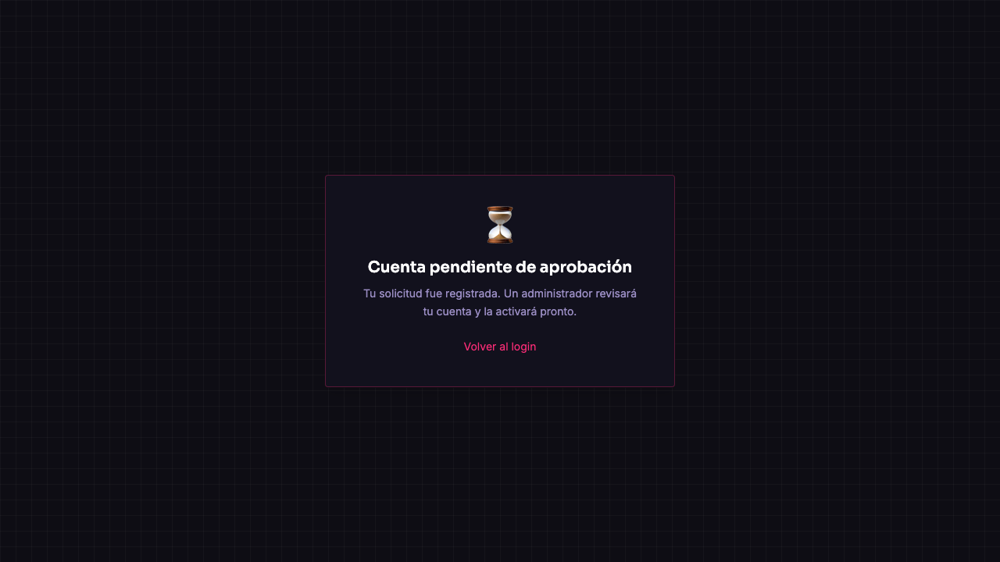

### 03_matches_dashboard
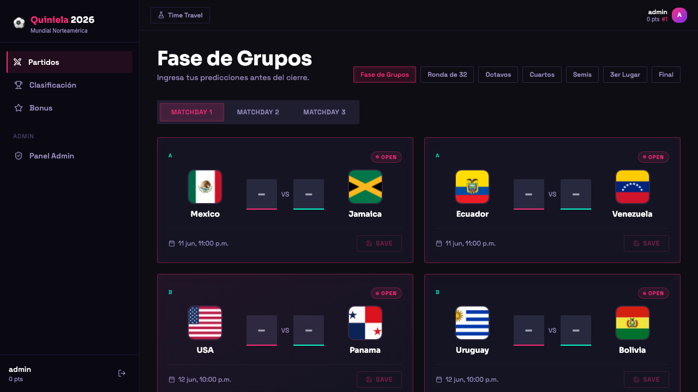

### 04_admin_users_tab
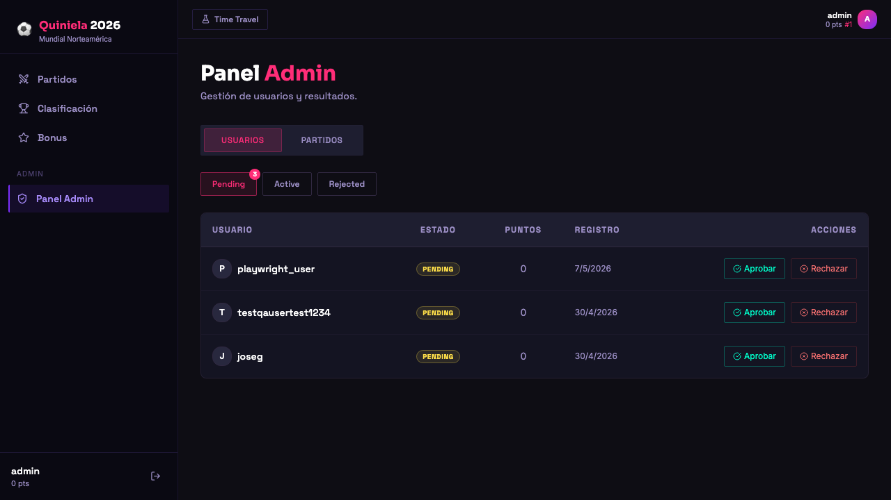

### 04b_admin_after_approve
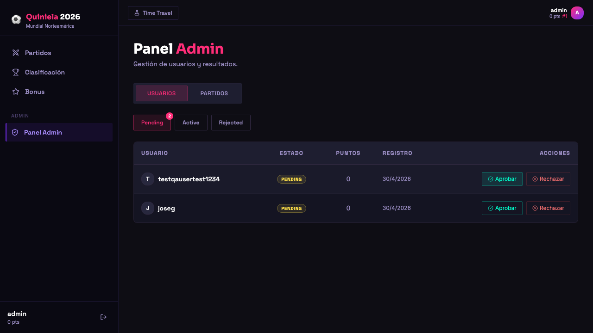

### 05_matches_page
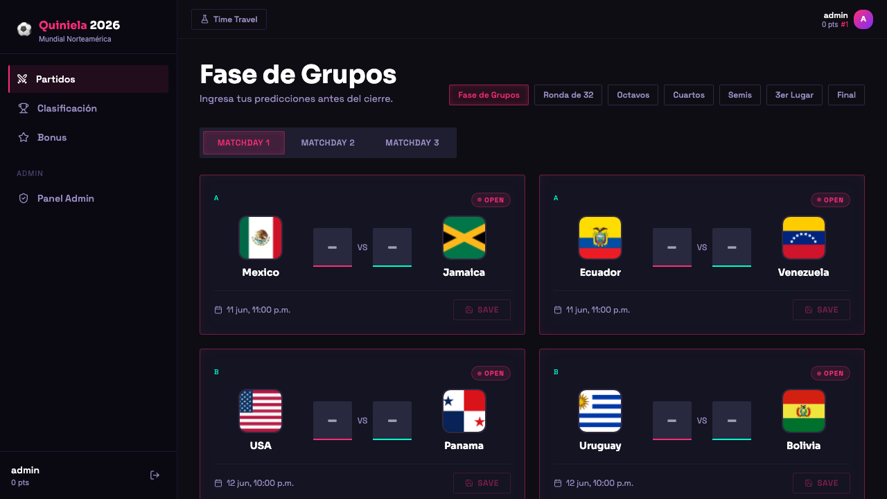

### 05b_matchday2
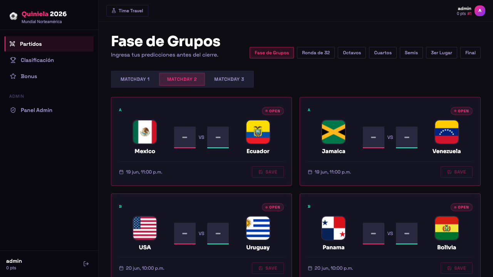

### 05c_matchday3
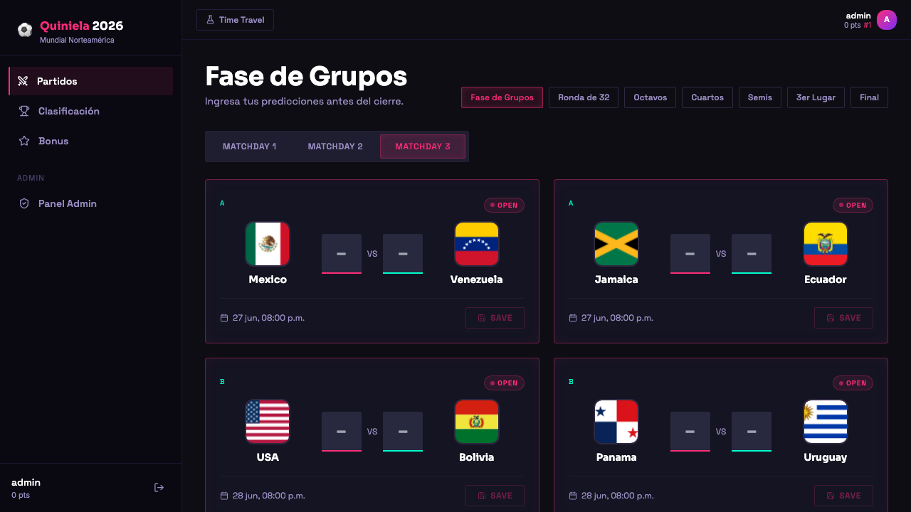

### 06_prediction_saved
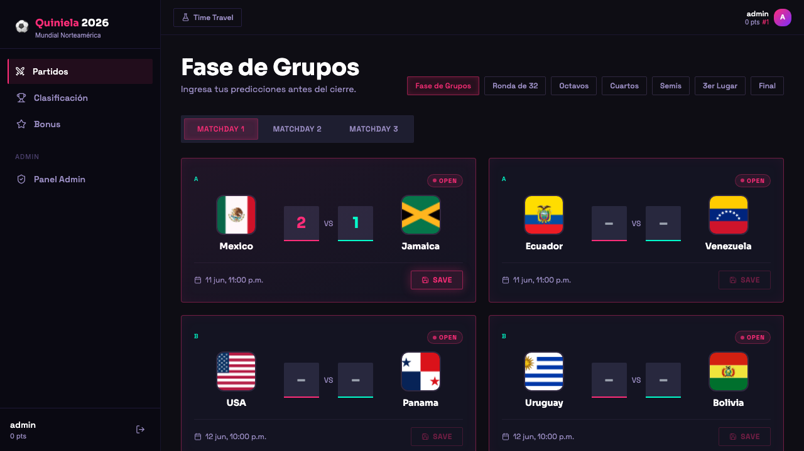

### 07_leaderboard
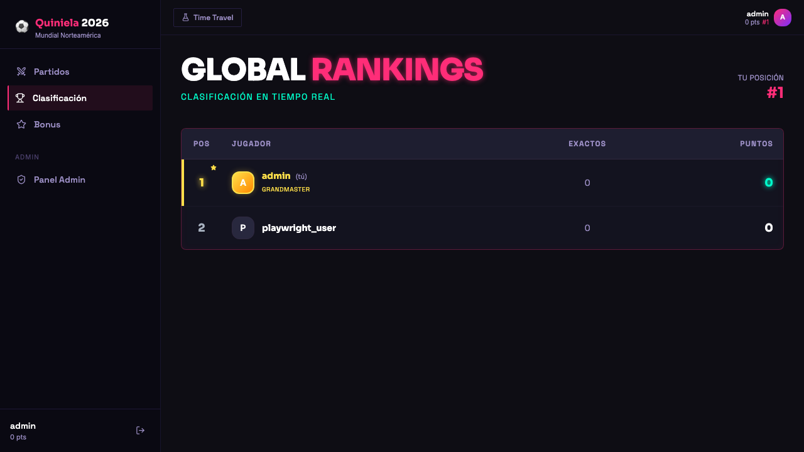

### 08_bonus_page
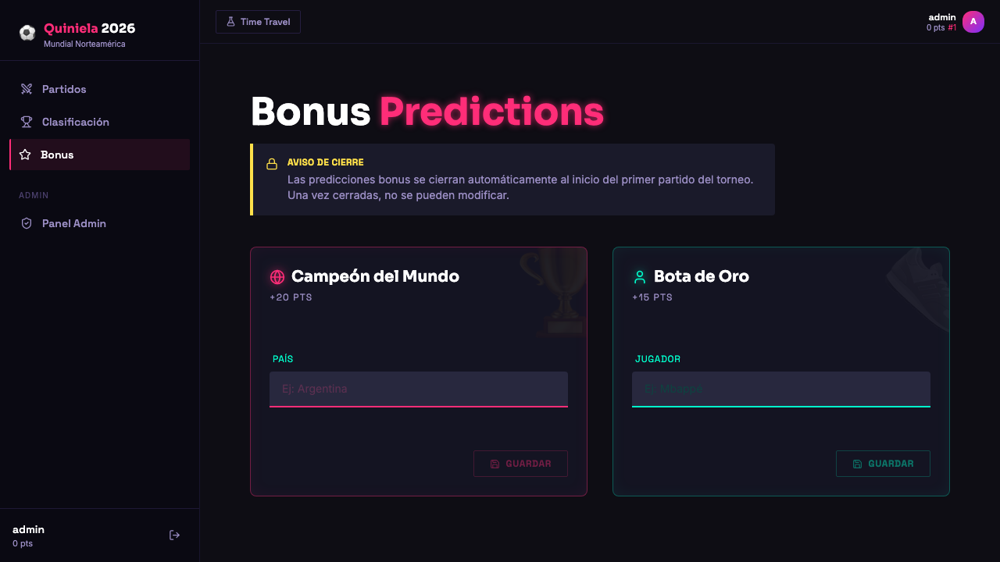

### 08b_bonus_champion_saved
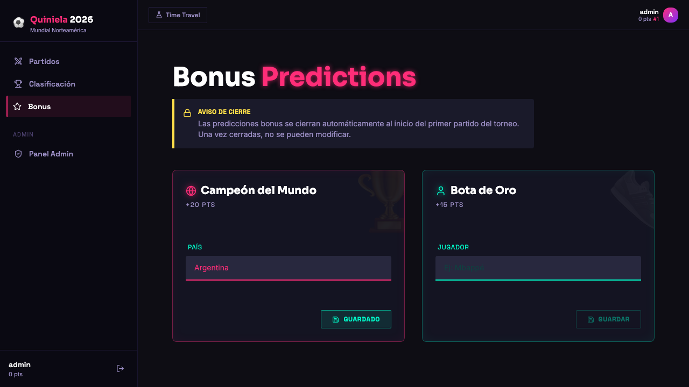

### 08c_bonus_topscorer_saved
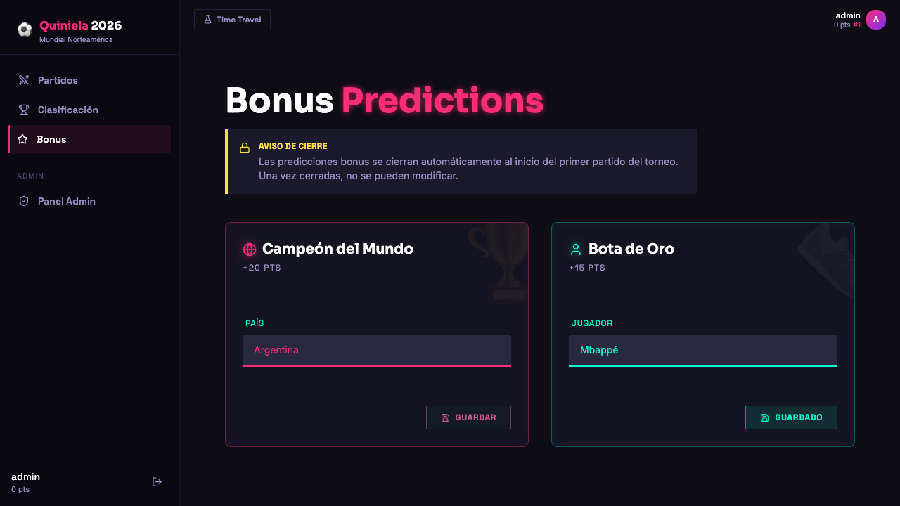

### 09_time_travel_active
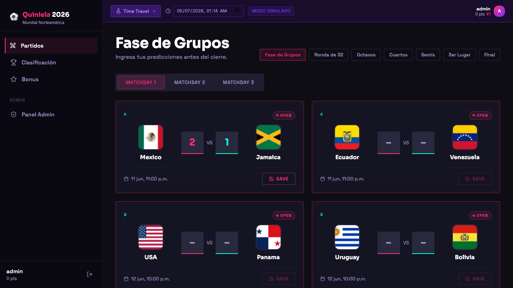

### 09b_time_travel_off
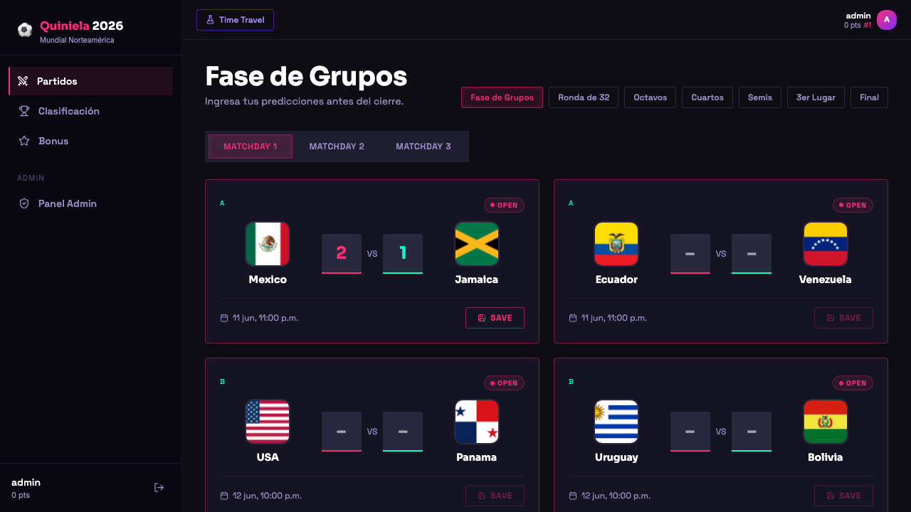

### 10_admin_matches_tab
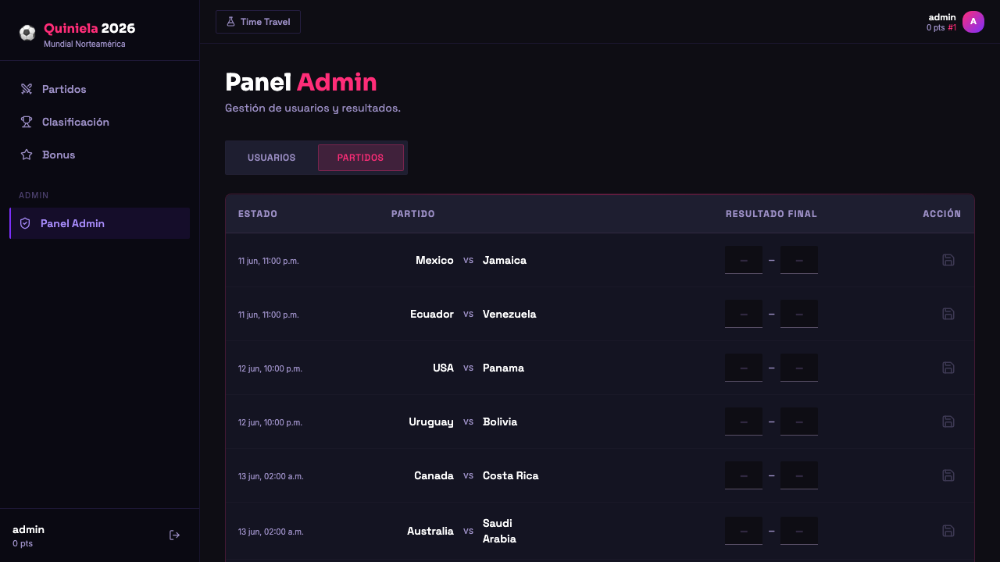

### 10b_result_saved
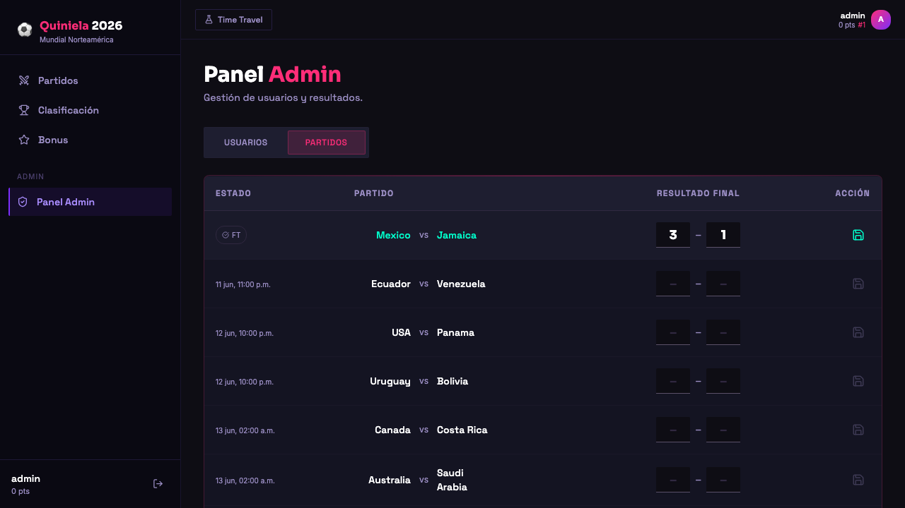

### 10c_leaderboard_after_result
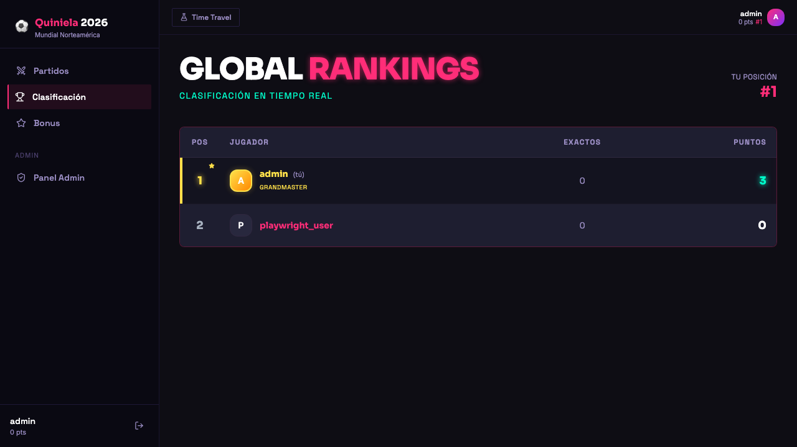

### 11_after_logout
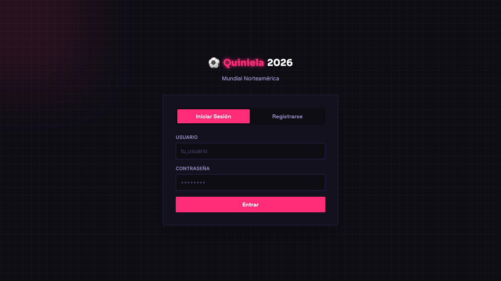
